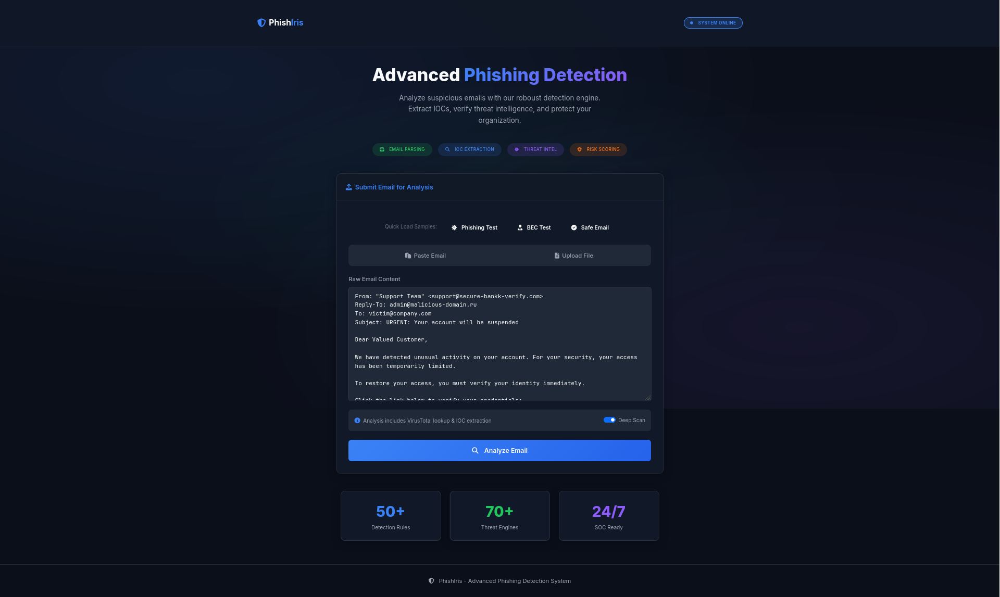
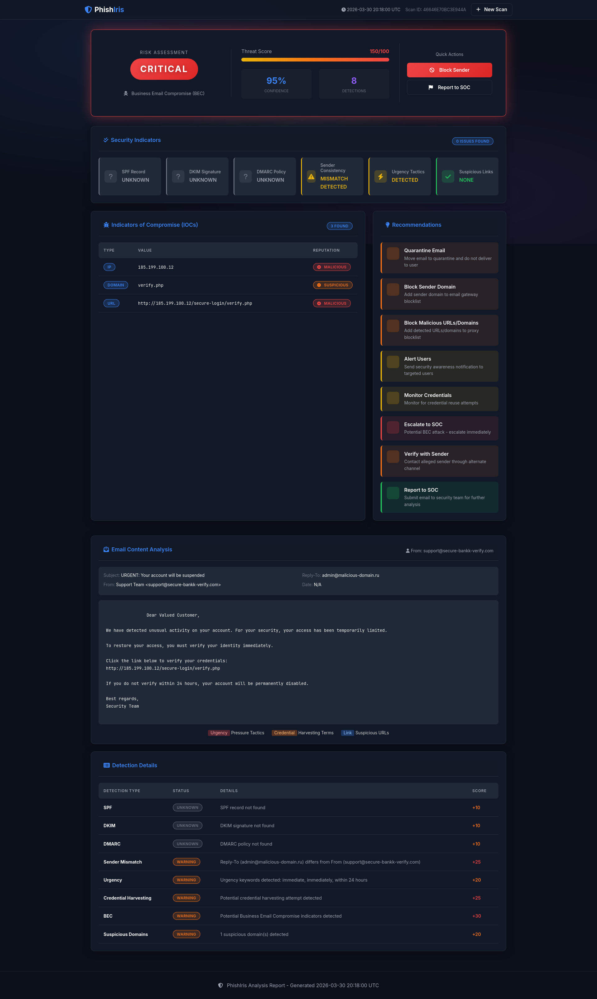

# 🔍 PhishIris — Intelligent Phishing Detection & Analysis Platform

PhishIris is a **SOC-inspired phishing detection and analysis tool** that simulates real-world email threat investigation workflows. It combines **rule-based detection, IOC extraction, threat intelligence enrichment, and risk scoring** into a unified system with a modern web dashboard.

---

## 🚀 Why PhishIris?

Recruiters don’t just look for tools — they look for **how you think like an analyst**.

PhishIris demonstrates:

* 🔎 Threat detection logic (like SIEM rules)
* 🧠 Analyst-style investigation workflow
* 🔗 Threat intelligence enrichment (VirusTotal)

---

## 🧠 Core Features

### 📨 Email Analysis Engine

* Parses raw email input (headers + body)
* Detects spoofing indicators, suspicious domains, and anomalies

### ⚙️ Detection Engine

* Rule-based detection using JSON logic
* Identifies:

  * Phishing patterns
  * Business Email Compromise (BEC)
  * Suspicious links & domains

### 🧪 IOC Extraction

* Extracts:

  * IP addresses
  * URLs
  * Domains
* Structures indicators for further investigation

### 🌐 Threat Intelligence Integration

* VirusTotal lookup for:

  * IP reputation
  * Domain analysis
* Enhances detection confidence

### 📊 Risk Scoring System

* Assigns severity levels:

  * 🟢 Low
  * 🟡 Medium
  * 🔴 High
* Based on detection rules + threat intel

### 📈 Web Dashboard (Flask UI)

* Displays:

  * Risk level (color-coded)
  * Extracted IOCs
  * Detection indicators
  * Analyst recommendations

---

## 🔄 Workflow

```
Email Input
   ↓
Header + Content Parsing
   ↓
Detection Engine (Rules + Score)
   ↓
IOC Extraction
   ↓
Threat Intelligence (VirusTotal)
   ↓
Risk Classification
   ↓
Report + Dashboard Output
```

---

## 🛠️ Tech Stack

* Python
* Flask
* VirusTotal API
* HTML, CSS (UI Dashboard)

---

## 📂 Project Structure

```
phishiris/
├── app.py                # Main Flask application
├── detector.py           # Detection logic
├── parser.py             # Email parsing
├── ioc_extractor.py      # IOC extraction
├── vt_lookup.py          # VirusTotal integration
├── templates/            # HTML UI
├── static/               # CSS, assets
├── examples/             # Sample emails
├── requirements.txt
└── screenshots/          # UI images 
```

---

## 🖥️ Screenshots

### 📊 Dashboard



### 🚨 Detection Output



---

## ⚙️ Setup Instructions

### 1. Clone the repository

```
git clone https://github.com/cinchu27/PhishIris.git
cd PhishIris
```

### 2. Create virtual environment

```
python3 -m venv venv
source venv/bin/activate
```

### 3. Install dependencies

```
pip install -r requirements.txt
```

### 4. Add VirusTotal API key

```
export VT_API_KEY="your_api_key"
```

### 5. Run the application

```
python app.py
```

### 6. Open in browser

```
http://127.0.0.1:5000
```

---

## 🎯 Use Cases

* SOC Analyst training & portfolio project
* Phishing detection simulation
* Threat investigation workflow demonstration
* Resume project for cybersecurity roles

---

## 💡 Future Improvements

* 🔁 SOAR integration (auto response actions)
* 📊 Advanced dashboards (charts, trends)
* 🧠 ML-based phishing detection
* ☁️ Deployment (Docker / Cloud)

---

## 👤 Author

**Cinchana S**

* GitHub: [https://github.com/cinchu27](https://github.com/cinchu27)
* LinkedIn: [https://www.linkedin.com/in/cinchanas/](https://www.linkedin.com/in/cinchanas/)

---

## ⭐ If you found this useful

Give it a ⭐ on GitHub — it helps visibility and supports the project!


